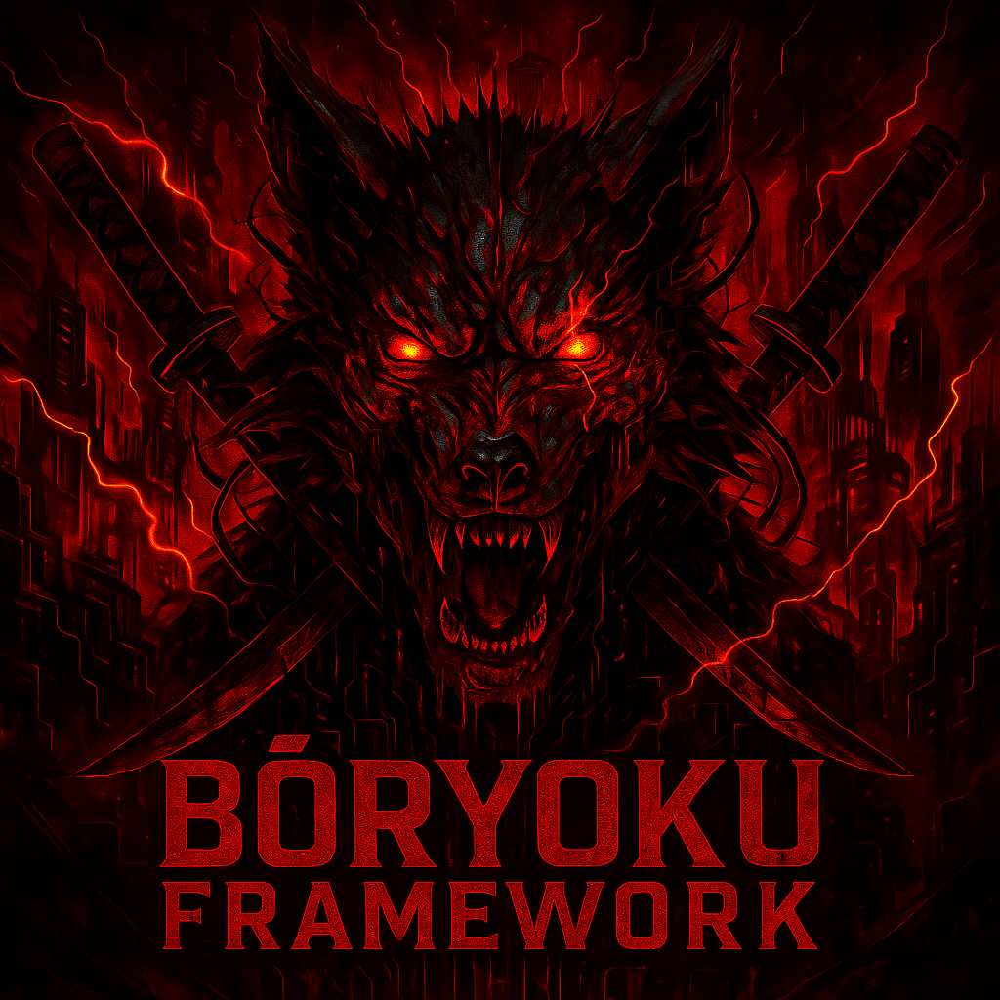
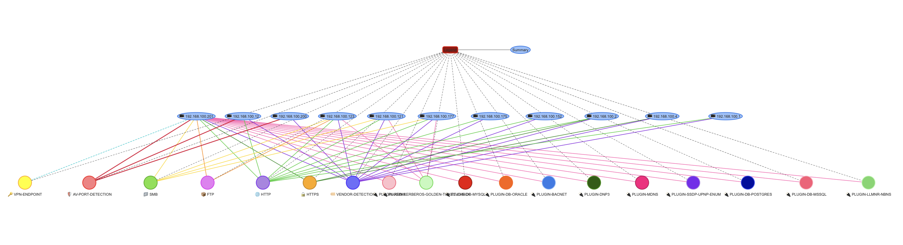
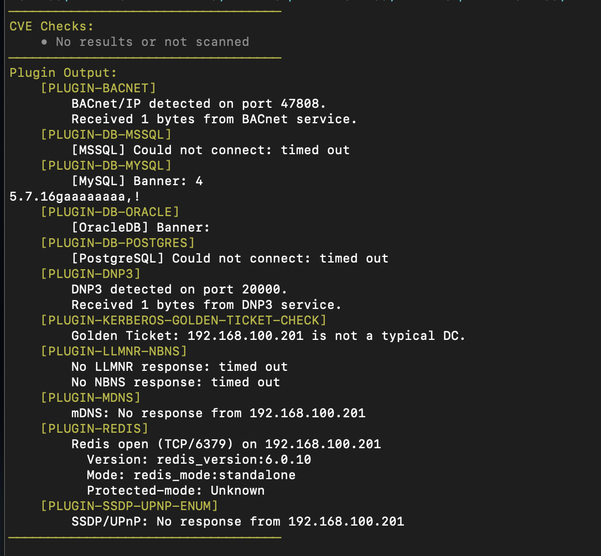
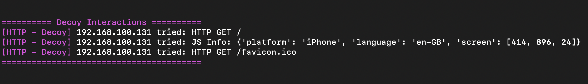

<p align="center">
  
</p>

# Bōryoku Framework - v3.0.1


<br>
<br>
[](LICENSE)

## 🔍 Overview

**Bōryoku** is an advanced reconnaissance, enumeration, misconfiguration, and deception discovery framework tailored for red teamers, penetration testers, and security engineers. It scans, fingerprints, and analyzes services for exposures.

**Bōryoku Framework introduces:**
- **Decoy System:** A feature that targets and hunts blue teams by deploying 3 different honeypots (HTTP, SSH, LDAP) while performing scans. It offers anti-detection through dynamic randomized banner, header and message patterns.
- **ARSENAL:** An Extended Plugin Modularity architecture which offers reconnaissance and enumeration for ICS/SCADA, Docker, Kubernetes, Active Directory and much more.
- **CVE Engine:** A vulnerability detection engine for network services and web applications.
- **VPN Detection:** Ability to detect VPN endpoints.
- **Network Visualization:** Visualizes all the scanning results.

## ⚙️ Features

- **🗂️ SMB guest access detection and share browsing**<br>
Detect open SMB shares accessible without authentication and list their contents.
- **📁 FTP anonymous login and file listing**<br>
Log in anonymously to FTP servers and enumerate their contents.
- **🌐 HTTP(S) directory enumeration using wordlists**<br>
Discover exposed files and folders via smart wordlist-based probing.
- **🕵️ Honeypot rule-based detection and scoring engine**<br>
Detect honeypot systems using banners, file patterns, and behavioral rules.
- **🧬 AV/EDR/XDR/Firewall port and signature-based detection:** <br>
Identify common defense mechanisms based on known fingerprints.
- **🧩 ARSENAL - Extended Plugin Modularity:** <br>
  - ICS/SCADA (Modbus, DNP3, BACnet, S7comm)
  - Databases (MySQL, MSSQL, PostgreSQL, Oracle)
  - Docker and Kubernetes
  - Kerberos
  - LDAP
  - LLMNR/NBNS
  - mDNS
  - NetBIOS
  - Redis
  - SNMP
  - SSDP/UPnP.
- **🦠 CVE Engine:** <br>
  - Automated vulnerability checks for web and network services.
- **🎭 Decoy System:** <br>
  - HTTP, SSH, LDAP decoy servers for interaction logging.
- **📶 VPN Detection:** <br>
  - Ability to detect VPN endpoints through port patterns.
- **🏷️ MAC-to-vendor fingerprinting:** <br>
Resolve hardware vendors using MAC address prefixes and ARP responses.
- **🕶️ Stealth mode with randomized delays:** <br>
Evade basic detection systems by randomizing request timing.
- **🔔 Discord and Slack webhook support** <br>
Automatically push scan results to collaboration channels for team visibility.
- **🧾 Output results saving:** <br>
Save clean and color-free results for reports, automation, or offline review.
- **🗺️ Network Visualization:** <br>
  - Interactive network/service mapping.

---

## 🧷 Detection Coverage

Bōryoku leverages an extensive and growing detection database to identify security products, honeypots, and deception systems through open ports, service banners, file artifacts, and behavioral indicators.

### 📡 Detection Stats

- **AV/EDR/XDR Port Detection:** `90+` well-known AV/EDR/XDR ports
- **HTTP(S) Banner Signatures:** `300+` keyword indicators for all brands
- **FTP File Fingerprints:** `150+` file indicators across brands
- **SMB Share/File Fingerprints:** `150+` unique patterns for AV/EDR artifacts

### 🧾 Coverage

| Category   | # of Brands |
|------------|-------------|
| **AV**     | 27          |
| **EDR**    | ~10         |
| **XDR**    | ~4          |
| **Firewall** | 13        |
| **Plugins** | 12+        |

## 🧱 Folder Structure

```
Boryoku/
├── boryoku.py
├── requirements.txt
├── README.md
├── boryoku-framework.png
├── arsenal/
│   ├── db-enum/ (mssql_enum.py, mysql_enum.py, oracle_enum.py, postgres_enum.py)
│   ├── docker-k8s/ (docker_k8s_enum.py)
│   ├── ics-scada/ (bacnet_enum.py, dnp3_enum.py, modbus_enum.py, s7_enum.py)
│   ├── kerberos/ (...kerberos plugins...)
│   ├── ldap/ (ldap-ad-enum.py)
│   ├── llmnr-nbns/ (llmnr-nbns.py)
│   ├── mdns/ (mdns.py)
│   ├── netbios/ (netbios-name.py)
│   ├── redis/ (redis.py)
│   ├── snmp/ (snmp.py)
│   ├── ssdp-upnp/ (ssdp-upnp-enum.py)
├── cve-check/
│   ├── network/ (...network CVE scripts...)
│   ├── web/ (...web CVE scripts...)
├── decoy/
│   ├── http_decoy.py
│   ├── ldap_decoy.py
│   ├── ssh_decoy.py
├── rules/
│   └── honeypot_detection_rules.json
├── signatures/
│   ├── av_ports.json
│   ├── av_signatures.json
│   ├── oui_vendors.json
│   └── vpn-check.json
├── webhooks/
│   ├── discord.txt
│   └── slack.json
├── wordlists/
│   ├── dirs.txt
│   └── usernames.txt
├── mapping/
│   └── *.html (network visualizations)
```

---

## 🌐 Webhook Integration

- **Discord**: Put your webhook URL inside `webhooks/discord.txt`.
- **Slack**: Put your Slack Bot App Token and Channel ID details in `webhooks/slack.json` (Example below):
```json
{
  "bot_token": "xoxb-...",
  "channel_id": "C12345678"
}
```

---

## 🖼️ Examples
<p align="center">
  
</p>
<br>
<p align="center">
  
</p>
<br>
<p align="center">
  
</p>
<br>
<p align="center">
  
</p>
<br>
<p align="center">
  
</p>


---

## 🛠️ Troubleshooting
1. Run the tool as **sudo** for proper ARP - MAC Address Identification feature usage.
2. If you encounter errors, check Impacket installation and Python dependencies.
3. For plugin errors, ensure all arsenal and cve-check scripts are present and compatible.
4. It is highly recommended to be in the same directory as the tool when executing it.
5. If the tool is running slow, you can raise the "max_workers" values within the script.

---

## 📚 Credits

Created by **Dion Mulaj**  
GitHub: [@dionmulaj](https://github.com/dionmulaj)

---

## 📜 License
This project is licensed under the Custom Non-Commercial Attribution License (CNCAL).
You are free to:

✅ Use and modify the software.
❌ Not use it for commercial purposes.
❌ Not misrepresent authorship (credit required).
See the [LICENSE](LICENSE.md) file for full details.

---

## ⚠️ Disclaimer

This tool is intended for educational and authorized testing purposes only. Usage on networks you don’t own or have explicit permission to test is **illegal** and **unethical**.

---
