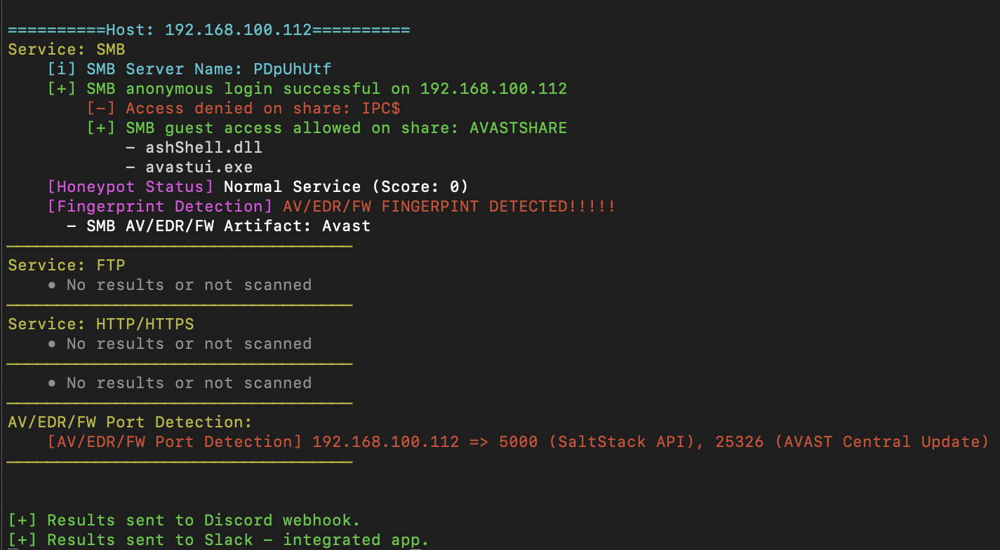
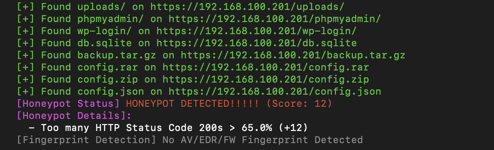

<p align="center">
  
</p>

# Bōryoku V2


## 🔍 Overview

**Bōryoku** is an advanced active enumeration and misconfiguration discovery tool tailored for red teamers, penetration testers, and security engineers. It specializes in scanning and fingerprinting services that commonly expose sensitive information when misconfigured.

Built with modularity in mind, Bōryoku is designed to identify access controls, exposed directories, honeypots, AV/EDR/XDR/FW footprints, and device vendors in internal networks.

---

## ⚙️ Features

- **🗂️ SMB guest access detection and share browsing:** <br>
Detect open SMB shares accessible without authentication and list their contents.
- **📁 FTP anonymous login and file listing:** <br>
Log in anonymously to FTP servers and enumerate their contents.
- **🌐 HTTP(S) directory brute-forcing using wordlists:** <br>
Discover exposed files and folders via smart wordlist-based probing.
- **🕵️ Honeypot rule-based scoring engine:** <br>
Detect honeypot systems using banners, file patterns, and behavioral rules.
- **🧬 AV/EDR/XDR/Firewall port and signature-based detection:** <br>
Identify common defense mechanisms based on known fingerprints.
- **🏷️ MAC-to-vendor fingerprinting:** <br>
Resolve hardware vendors using MAC address prefixes and ARP responses.
- **🕶️ Stealth mode with randomized delays:** <br>
Evade basic detection systems by randomizing request timing.
- **🔔 Discord and Slack webhook support** <br>
Automatically push scan results to collaboration channels for team visibility.
- **🧾 Output results saving:** <br>
Save clean and color-free results for reports, automation, or offline review.

---

## 🧷 Detection Coverage

Bōryoku leverages an extensive and growing detection database to identify security products, honeypots, and deception systems through open ports, service banners, file artifacts, and behavioral indicators.

### 📡 Detection Stats

- **AV/EDR/XDR Port Detection:** `90+` well-known AV/EDR/XDR ports
- **HTTP(S) Banner Signatures:** `300+` keyword indicators for all brands
- **FTP File Fingerprints:** `150+` file indicators across brands
- **SMB Share/File Fingerprints:** `150+` unique patterns for AV/EDR artifacts

### 🧾 Coverage

| Category   | # of Brands |
|------------|-------------|
| **AV**     | 27          |
| **EDR**    | ~10         |
| **XDR**    | ~4          |
| **Firewall** | 13        |

### 🧠 Honeypot Detection Logic

Detection is based on:
- Suspicious banners
- Known fake files or shares
- High ratio of `HTTP 200 OK` responses to sensitive paths
- Unrealistically clean FTP/SMB listings

Rules are fully customizable in `rules/honeypot_detection_rules.json`.

This rich signature set allows **Bōryoku** to go beyond basic service checks and deliver valuable context about defensive tooling and misconfiguration exposure within target environments.

---

## 📦 Installation

```bash
git clone https://github.com/dionmulaj/boryoku.git
cd boryoku
pip3 install -r requirements.txt
```

Ensure you have the following:
- Python 3.8+
- Linux/macOS

---

## 🚀 Usage

### Basic Command

```bash
python3 boryoku.py -t 192.168.1.0/24 -smb -ftp -http
```

### Full Scan with Stealth and AV Detection

```bash
python3 boryoku.py -t 10.0.0.0/24 -all --stealth --anti-virus -o results.txt
```

---

## 🧠 Arguments

| Flag | Description |
|------|-------------|
| `-t` | Target IP or CIDR range |
| `-smb` | Enable SMB guest access scan |
| `-ftp` | Enable FTP anonymous access scan |
| `-http` | Enable HTTP(S) directory scan |
| `-all` | Shortcut for all scans |
| `--stealth` | Introduce delays between scans |
| `--anti-virus` | Detect common AV/EDR/FW ports |
| `-o` | Save output to text file |
| `--discord` | Send output to Discord webhook |
| `--slack` | Send output to Slack webhook |

---

## 🧱 Folder Structure

```
boryoku/
├── signatures/
│   ├── av_ports.json
│   ├── av_signatures.json
│   └── oui_vendors.json
├── rules/
│   └── honeypot_detection_rules.json
├── wordlists/
│   └── dirs.txt
├── webhooks/
│   ├── discord.txt
│   └── slack.json
├── examples/
│   ├── av-detection.png
│   └── honeypot-detection.png
└── boryoku.py
└── requirements.txt
└── README.md
└── Boryoku-Logo.PNG
```

---

## 🌐 Webhook Integration

- **Discord**: Put your webhook URL inside `webhooks/discord.txt`.
- **Slack**: Put your Slack Bot App Token and Channel ID details in `webhooks/slack.json` (Example below):
```json
{
  "bot_token": "xoxb-...",
  "channel_id": "C12345678"
}
```

---

## 🖼️ Examples
<p align="center">
  
</p>
<br>
<p align="center">
  
</p>

---

## 🛠️ Troubleshooting
1. Run the tool as **sudo** for proper ARP - MAC Address Identification feature usage. <br>
2. If you encounter errors while running the tool, it can most likely be because of Impacket misconfiguration.
To fix such an issue, try running the command below:

```bash
sudo apt install python3-pip python3-dev build-essential libssl-dev libffi-dev
```

---

## 📚 Credits

Created by **Dion Mulaj**  
GitHub: [@dionmulaj](https://github.com/dionmulaj)

---

## ⚠️ Disclaimer

This tool is intended for educational and authorized testing purposes only. Usage on networks you don’t own or have explicit permission to test is **illegal** and **unethical**.

---
